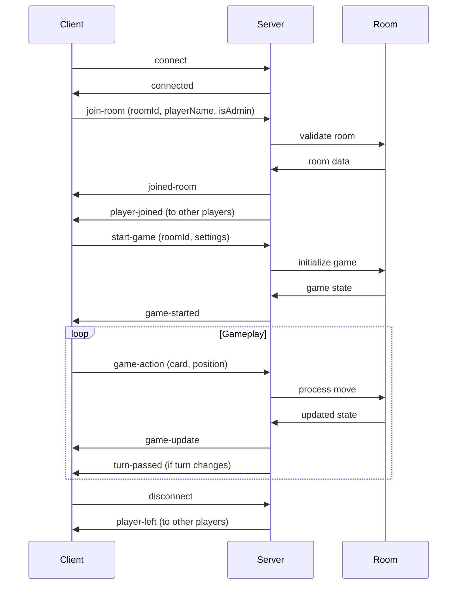

# Sequence Game Flow Diagram

## Complete Online Game Flow

```mermaid
flowchart TD
    A[User Opens Game] --> B{Connected to Server?}
    B -->|No| C[Show Loading Screen]
    C --> D[Connect to Socket.IO Server]
    D --> E{Connection Success?}
    E -->|No| F[Show Error Screen]
    E -->|Yes| G[Show Game Lobby]
    
    G --> H{User Action}
    H -->|Create Room| I[Enter Player Name]
    H -->|Join Room| J[Enter Player Name + Room ID]
    
    I --> K[Generate Random Room ID]
    K --> L[Send join-room with isAdmin=true]
    J --> M[Send join-room with isAdmin=false]
    
    L --> N{Server Validation}
    M --> N
    N -->|Room Full| O[Show "Room Full" Error]
    N -->|Name Taken| P[Show "Name Taken" Error]
    N -->|Invalid Room| Q[Show "Room Not Found" Error]
    N -->|Success| R[Emit joined-room Event]
    
    R --> S[Update URL with Room ID]
    S --> T[Show Room Lobby]
    
    T --> U{Player Role}
    U -->|Admin| V[Show Game Settings + Start Button]
    U -->|Regular Player| W[Show Wait for Game Start]
    
    V --> X[Configure Game Settings]
    X --> Y[Click Start Game]
    Y --> Z{Enough Players?}
    Z -->|No| AA[Show "Need 2+ Players" Error]
    Z -->|Yes| BB[Initialize Game State]
    
    BB --> CC[Deal Cards to Players]
    CC --> DD[Set Current Player]
    DD --> EE[Start Turn Timer]
    EE --> FF[Emit game-started Event]
    
    FF --> GG[Show Game Board]
    GG --> HH[Display Player Hands]
    HH --> II[Show Current Turn Indicator]
    
    II --> JJ{Player's Turn?}
    JJ -->|No| KK[Show "Wait for Turn" Message]
    JJ -->|Yes| LL[Enable Card Selection]
    
    LL --> MM[Player Selects Card]
    MM --> NN[Show Valid Positions]
    NN --> OO[Player Clicks Position]
    OO --> PP{Valid Move?}
    PP -->|No| QQ[Show Invalid Move Error]
    PP -->|Yes| RR[Send game-action Event]
    
    RR --> SS[Server Processes Move]
    SS --> TT[Update Game State]
    TT --> UU[Remove Card from Hand]
    UU --> VV[Place Chip on Board]
    VV --> WW[Check for Sequences]
    WW --> XX{Sequence Found?}
    XX -->|Yes| YY[Add to Sequences]
    XX -->|No| ZZ[Continue Game]
    
    YY --> AAA{2 Sequences for Team?}
    AAA -->|Yes| BBB[Set Winner]
    AAA -->|No| ZZ
    BBB --> CCC[Set Game Phase to 'finished']
    CCC --> DDD[Emit game-update Event]
    
    ZZ --> EEE[Move to Next Player]
    EEE --> FFF[Reset Turn Timer]
    FFF --> GGG[Emit turn-passed Event]
    
    DDD --> HHH[Show Win Celebration]
    GGG --> II
    QQ --> LL
    
    HHH --> III[Game Over]
    III --> JJJ[Return to Lobby]
    
    KK --> LLL[Turn Timer Expires]
    LLL --> EEE
    
    O --> G
    P --> G
    Q --> G
    AA --> V
```

## Key Components Breakdown

### 1. **Connection Phase**
- Socket.IO connection establishment
- Error handling for connection failures
- Loading states and user feedback

### 2. **Room Management**
- Room creation with unique ID generation
- Player joining with name validation
- Admin vs regular player roles
- Room capacity management

### 3. **Game Initialization**
- Game settings configuration (max players, turn time, game mode)
- Card dealing and hand distribution
- Board state initialization
- Turn management setup

### 4. **Gameplay Loop**
- Turn-based gameplay with timer
- Card selection and position validation
- Move processing and state updates
- Sequence detection and win conditions

### 5. **Real-time Synchronization**
- Socket events for state updates
- Multi-player synchronization
- Error handling and reconnection

## Socket Events Flow



## State Management

### Client State
- `isConnected`: Socket connection status
- `currentRoom`: Current room data
- `gameState`: Local game state
- `selectedCard`: Currently selected card
- `selectedPosition`: Currently selected position

### Server State
- `gameRooms`: Map of active rooms
- `players`: Map of players in each room
- `gameState`: Current game state per room
- `settings`: Room configuration
- `timers`: Turn timers per room

## Error Handling

1. **Connection Errors**: Auto-reconnection attempts
2. **Room Errors**: Clear error messages for invalid rooms
3. **Game Errors**: Validation for moves and actions
4. **Network Errors**: Graceful degradation and recovery

## Key Features

- **Real-time Multiplayer**: Socket.IO for instant updates
- **Turn-based Gameplay**: Timer-based turn management
- **Room System**: Create/join rooms with unique IDs
- **Admin Controls**: Room creator manages game settings
- **Sequence Detection**: Automatic win condition checking
- **Responsive UI**: Modern, mobile-friendly interface
- **Error Recovery**: Robust error handling and reconnection

